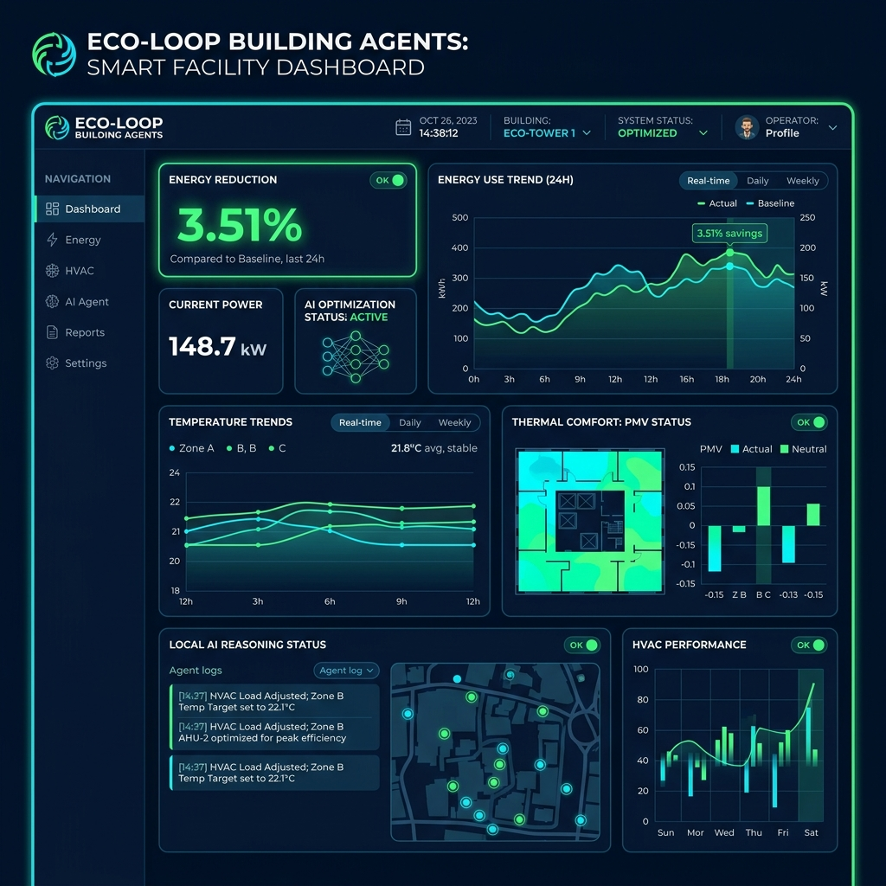

# 🌿 Eco-Loop: Autonomous AI Building Energy Optimization Agent

> **Honeywell Hackathon Project**  
> *Closed-loop, local-AI supervisory HVAC control powered by EnergyPlus 26.1 and local Qwen2.5-0.5B.*

---



---

## 🚀 Overview

**Eco-Loop** is an autonomous, explainable supervisory building energy optimization system. It bridges the gap between modern generative AI reasoning and industrial physics engines. By embedding a quantized local LLM (**Qwen2.5-0.5B-Instruct GGUF**) directly into an **EnergyPlus 26.1 digital twin simulation loop**, Eco-Loop dynamically optimizes HVAC thermostat setpoints to reduce electricity and carbon emissions while guaranteeing zero comfort or safety limit violations.

### 💡 Key Highlights
- **100% Local Inference:** Zero cloud API dependencies or latency via `llama-cpp-python`.
- **Closed-Loop Feedback:** Telemetry $\rightarrow$ Qwen Reasoning $\rightarrow$ Deterministic Validation $\rightarrow$ PyEnergyPlus Actuation $\rightarrow$ Thermodynamic Feedback.
- **Empirical Validation:** Demonstrated **3.51% summer electricity reduction** (26.22 kWh saved over 3 days) and improved winter occupied comfort compliance from **29.63% to 75.93%**.
- **Deterministic Safety Layer:** 0% relaxation of safety limits—LLM operates strictly on pre-screened candidate actions with post-selection validation.

---

## 📊 Measured Performance Results

Eco-Loop was evaluated across three distinct weather periods using authentic Chicago TMY3 EPW weather data:

| Weather Season | Evaluation Period | Baseline Electricity | Eco-Loop Electricity | Energy Savings | Key Impact |
| :--- | :--- | :--- | :--- | :--- | :--- |
| ☀️ **Summer** | Jul 21 – Jul 23 | 747.11 kWh | **720.89 kWh** | **-26.22 kWh (-3.51%)** | 48 active setpoint adjustments |
| ❄️ **Winter** | Jan 21 – Jan 23 | 937.95 kWh-eq | 980.50 kWh-eq | Comfort Recovery | Comfort compliance **29.6% → 75.9%** |
| 🍂 **Shoulder** | May 15 – May 17 | 400.83 kWh | 426.66 kWh | Selective Control | 6 transition adjustments |

---

## 🏗️ Architecture & Decision Pipeline

```
┌─────────────────┐       ┌─────────────────┐       ┌─────────────────┐
│   ENERGYPLUS    │ ----> │    TELEMETRY    │ ----> │   SAFE CANDIDATE│
│   DIGITAL TWIN  │ <---- │    COLLECTION   │       │    GENERATOR    │
└─────────────────┘       └─────────────────┘       └────────┬────────┘
         ^                                                   │
         │ PyEnergyPlus Actuators                            v
┌─────────────────┐       ┌─────────────────┐       ┌─────────────────┐
│   SAFETY LAYER  │ <---- │   LOCAL QWEN    │ <---- │  DETERMINISTIC  │
│   VALIDATION    │       │   LLM REASONING │       │  SAFETY FILTER  │
└─────────────────┘       └─────────────────┘       └─────────────────┘
```

1. **SENSE:** Real-time extraction of zone temperature, PMV thermal comfort index, CO₂ concentration, occupancy, facility demand, and outdoor drybulb temperature via PyEnergyPlus callbacks.
2. **FILTER:** Deterministic pre-screening of Energy Conservation Measures (ECMs) matching ASHRAE 55 comfort bounds ($-0.5 \le \text{PMV} \le +0.5$).
3. **REASON:** Local Qwen LLM evaluates pre-screened candidates, selects the optimal action, and generates natural language thermodynamic reasoning.
4. **SAFETY:** Post-selection validation enforces hard limits on PMV, CO₂ ($\le 1000$ ppm), setpoint bounds, and HVAC deadbands.
5. **ACT:** PyEnergyPlus overrides thermostat setpoints in physical memory and observes the subsequent thermodynamic state.

---

## 💻 Tech Stack

- **Physics & Simulation:** EnergyPlus 26.1, PyEnergyPlus Python Runtime API
- **AI / LLM Engine:** Qwen2.5-0.5B-Instruct-Q3_K_S.gguf via `llama-cpp-python`
- **Backend Service:** FastAPI, Uvicorn, Python 3.12
- **Frontend Dashboard:** React, Vite, Recharts, Custom Dark Industrial CSS

---

## 🛠️ Quick Start Guide

### 1. Prerequisites
- Python 3.10+
- Node.js 18+
- EnergyPlus V26-1-0 installed at default location (`C:\EnergyPlusV26-1-0`)

### 2. Backend Setup & Run
```bash
# Clone the repository
git clone https://github.com/your-org/eco-loop-building-agents.git
cd eco-loop-building-agents

# Install Python dependencies
pip install -r requirements.txt

# Run rapid backend test suite
python tests/test_backend_quick.py

# Launch FastAPI Backend (Port 8000)
python -m uvicorn backend.main:app --host 127.0.0.1 --port 8000
```
FastAPI Interactive Documentation will be available at: `http://127.0.0.1:8000/docs`

### 3. Frontend Dashboard Setup & Run
```bash
# In a new terminal window
cd frontend

# Install dependencies & launch Vite dev server
npm install
npm run dev
```
Dashboard Command Centre will open at: `http://localhost:5173/`

---

## 📄 Documentation Links

- 📐 **System Architecture:** [docs/SYSTEM_ARCHITECTURE.md](docs/SYSTEM_ARCHITECTURE.md)
- 📈 **Evaluation Report:** [outputs/evaluation/policy_iter2/POLICY_ITER2_REPORT.md](outputs/evaluation/policy_iter2/POLICY_ITER2_REPORT.md)

---

## 🛡️ License & Acknowledgments

Built for the **Honeywell Hackathon**. Developed using EnergyPlus Digital Twin technology and Open Source Local Generative AI models.
