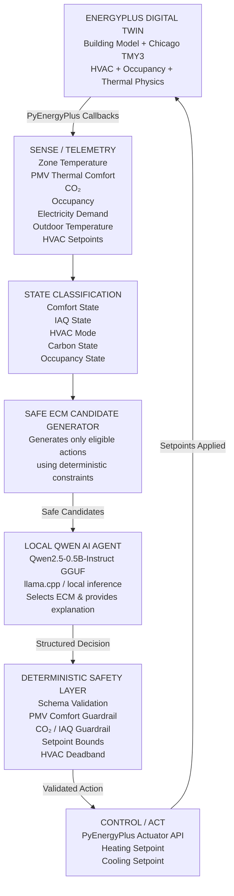
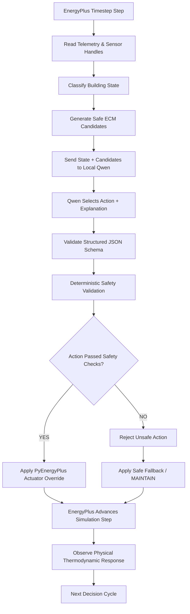
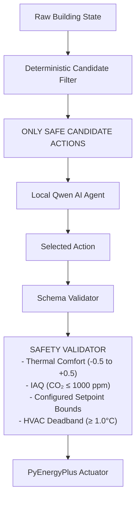
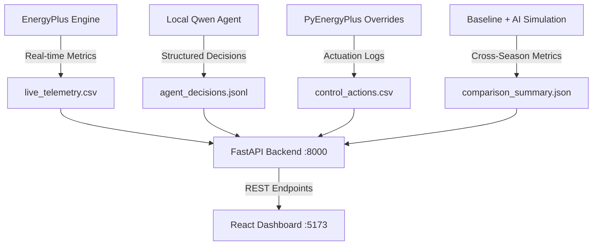
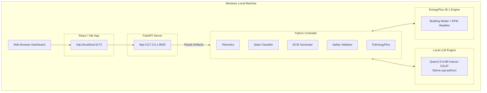

# Eco-Loop Building Agents — System Architecture

Eco-Loop is a closed-loop autonomous building optimisation system that combines an EnergyPlus digital twin, real-time building telemetry, deterministic safety guardrails, and a locally running Qwen LLM to make explainable HVAC control decisions.

---

## 1. High-Level System Architecture

---

## 2. Closed-Loop Agent Decision Flow

> **SAFETY PRINCIPLE:** The LLM does NOT have unrestricted HVAC control. All candidate actions are deterministically filtered before prompt construction, and selected decisions are strictly validated before PyEnergyPlus actuation.

---

## 3. System Components

| Component | Technology | Responsibility |
| :--- | :--- | :--- |
| **Digital Twin** | EnergyPlus 26.1 | Building thermodynamics and HVAC physics simulation |
| **Simulation API** | PyEnergyPlus | Runtime telemetry callbacks and actuator setpoint overrides |
| **Telemetry Layer** | Python (`energyplus/telemetry.py`) | Extracts temperature, PMV, CO₂, occupancy, demand, and setpoints |
| **State Classifier** | Python (`energyplus/telemetry.py`) | Transforms raw telemetry into semantic agent-readable states |
| **ECM Candidate Generator** | Python (`agent/orchestrator_v2.py`) | Deterministically filters and generates safe candidate actions |
| **AI Decision Agent** | Qwen2.5-0.5B-Instruct GGUF | Evaluates eligible candidates, selects optimal ECM, and provides reasoning |
| **Inference Runtime** | `llama-cpp-python` / GGUF | Executes Qwen LLM completely locally on CPU |
| **Safety Layer** | Python (`energyplus/control.py`) | Enforces deterministic PMV, CO₂, setpoint bounds, and deadband safety |
| **Control Layer** | PyEnergyPlus Actuators | Writes approved heating/cooling setpoints to EnergyPlus memory |
| **Evaluation Layer** | Python (`evaluation/`) | Compares baseline vs. Policy 1 vs. Policy 2 across seasons |
| **Backend API** | FastAPI (`backend/`) | Serves validated telemetry, agent decisions, actions, and hero metrics |
| **Dashboard** | React + Vite + Recharts (`frontend/`) | Single-page command centre dashboard for system visualization |

---

## 4. Safety Architecture

> **GUARANTEE:** Qwen never receives unrestricted actuator access. The LLM selects only from actions that have already passed deterministic eligibility checks, and its selected action is validated again before actuation.

---

## 5. Data Flow

> **VALIDATED REPLAY:** The submission dashboard reads previously generated real experimental artifacts (`VALIDATED_REPLAY` mode). It does not fabricate telemetry or claim artifact replay is a currently running simulation.

---

## 6. Deployment Architecture

> **100% LOCAL INFRASTRUCTURE:** Zero cloud API dependencies. EnergyPlus, Qwen LLM inference, FastAPI, and React run completely locally on a single machine.

---

## 7. Validated Experimental Result

### Validated Summer Evaluation — July 21–23 (Chicago EPW)

| Metric | Baseline | Eco-Loop |
| :--- | ---: | ---: |
| **Electricity Consumption** | 747.11 kWh | **720.89 kWh** |
| **Electricity Saved** | — | **26.22 kWh** |
| **Reduction** | — | **3.51%** |
| **AI Decisions** | — | **51** |
| **Effective Actions** | — | **48** |

Eco-Loop achieved a measured **3.51% electricity reduction** during the validated three-day summer experiment while operating through the closed-loop EnergyPlus + local-Qwen control architecture.

- **Winter Evaluation (Jan 21–23):** Occupied thermal comfort compliance improved from **29.63% to 75.93%**.
- **Shoulder Evaluation (May 15–17):** Executed **6 effective control actions** across 51 decisions during temperature transition periods.

---

## 8. Design Principles

1. **Local-first AI:** Zero cloud latency, 100% data privacy, and full offline operation via local GGUF quantization.
2. **Deterministic safety before and after LLM selection:** The LLM operates strictly within a pre-screened candidate set, with post-selection validation.
3. **Closed-loop physical feedback:** Every control action modifies the PyEnergyPlus digital twin state and directly informs subsequent AI decisions.
4. **Explainable autonomous decisions:** Every setpoint override is accompanied by structured thermodynamic reasoning and decision log audits.
5. **Measured results instead of projected savings:** Performance is validated empirically against EnergyPlus baseline simulations across real weather periods.
